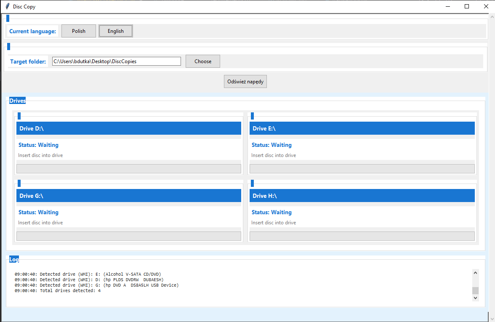
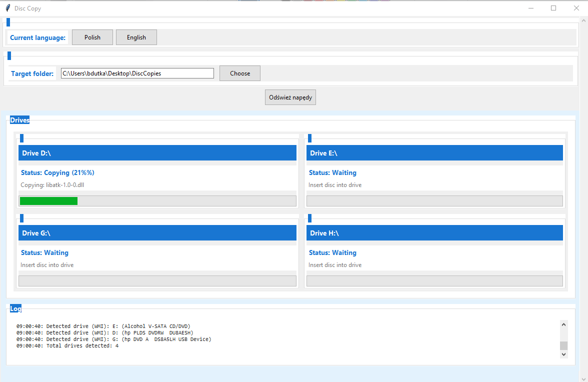

# SmartDiskCopier 💿

A modern Windows application for automated CD/DVD disc copying with multi-drive support, network drive support, and real-time progress tracking.

<div align="center">

[](https://opensource.org/licenses/MIT)


</div>

## ✨ Features

- 🖥️ Modern, user-friendly interface with dark mode support
- 📀 Support for multiple CD/DVD drives simultaneously
- 🌐 Network and RDP-redirected drive support
- 🔄 Automatic disc ejection after copying
- 🌍 Multilingual (English and Polish)
- 📊 Real-time progress monitoring for each drive
- 📝 Detailed operation logging
- 💾 Automatic folder naming with timestamps and usernames
- 🔵 System tray support with progress indication
- 📦 Optional ZIP archiving of copied content
- 🚀 Runs in background with minimized window
- 🔔 System notifications for important events
- ⚙️ External configuration file for easy settings adjustment

## 🎯 New Features

### System Tray Integration
- Minimizes to system tray with active icon
- Shows copy progress in tray icon
- Context menu for quick actions
- System notifications for copy events

### ZIP Archive Support
- Optional ZIP creation after copying
- Configurable through GUI and config file
- Preserves folder structure in archives

### External Configuration
- Settings stored in external config.json
- Can be modified even after compilation
- Persists user preferences between runs

### Background Operation
- Continues copying when minimized
- Automatic minimization during copy
- Shows/hides window on demand

## 🔧 Requirements

- Windows operating system
- Python 3.7 or newer
- CD/DVD drive(s) - physical or network/RDP redirected

## 🚀 Quick Start

### Installation

1. **Clone the repository**
   ```bash
   git clone https://github.com/yourusername/SmartDiskCopier.git
   cd SmartDiskCopier
   ```

2. **Install dependencies**
   ```bash
   pip install -r requirements.txt
   ```

### Running

1. **Run directly with Python**
   ```bash
   python SmartDiskCopier.py
   ```

2. **Or build executable**
   ```bash
   python build_exe.py
   ```
   The executable will be created in the `dist` folder.

### Building Executable

1. **Install PyInstaller**
   ```bash
   pip install pyinstaller
   ```

2. **Build using included script**
   ```bash
   python build_exe.py
   ```
   This will create `SmartDiskCopier.exe` in the `dist` folder.

3. **Manual build (alternative)**
   ```bash
   pyinstaller SmartDiskCopier.py --name=SmartDiskCopier --onefile --windowed --icon=app_icon.ico --add-data="translations.py;." --clean
   ```

4. **After building**
   - Executable will be in the `dist` folder
   - You can move the .exe file anywhere
   - No additional files needed to run
   - Double-click to launch

### Portable Version

To create a portable version:
1. Build the executable
2. Copy `SmartDiskCopier.exe` to a USB drive
3. Create a `config.ini` file (optional) in the same folder to store settings

## 💡 Usage

1. Launch the application
2. Select your preferred language (English/Polish)
3. Choose destination folder for copied files
4. Insert a disc into any CD/DVD drive
5. The application will automatically:
   - Detect the disc
   - Create a timestamped folder with username
   - Copy all contents
   - Eject the disc when finished
6. Repeat with next disc if needed

## Screenshots

### Main Window


### Active Copying Process


## 🔍 Troubleshooting

### Common Issues

1. **Missing dependencies**
   ```bash
   pip install --upgrade ttkthemes wmi pywin32
   ```

2. **Drive not detected**
   - Check if drive is visible in Windows
   - For RDP drives, ensure proper redirection
   - Verify administrator privileges

3. **Copy errors**
   - Check disc for damage
   - Ensure sufficient disk space
   - Verify write permissions

## ⚙️ Configuration

The `config.json` file controls various program settings:

## 🤝 Contributing

Contributions are welcome! Here's how you can help:

1. Fork the repository
2. Create a feature branch (`git checkout -b feature/AmazingFeature`)
3. Commit your changes (`git commit -m 'Add some AmazingFeature'`)
4. Push to the branch (`git push origin feature/AmazingFeature`)
5. Open a Pull Request

## 📄 License

This project is licensed under the MIT License - see the [LICENSE](LICENSE) file for details.

## 🙏 Acknowledgments

- Thanks to all contributors and users
- Built with Python and Tkinter
- Uses modern themes from ttkthemes

## 📞 Support

- Open an issue for bugs
- Submit feature requests via issues
- Contact author for serious matters

---
<div align="center">
Made with ❤️ for making disc copying easier
</div>
````

